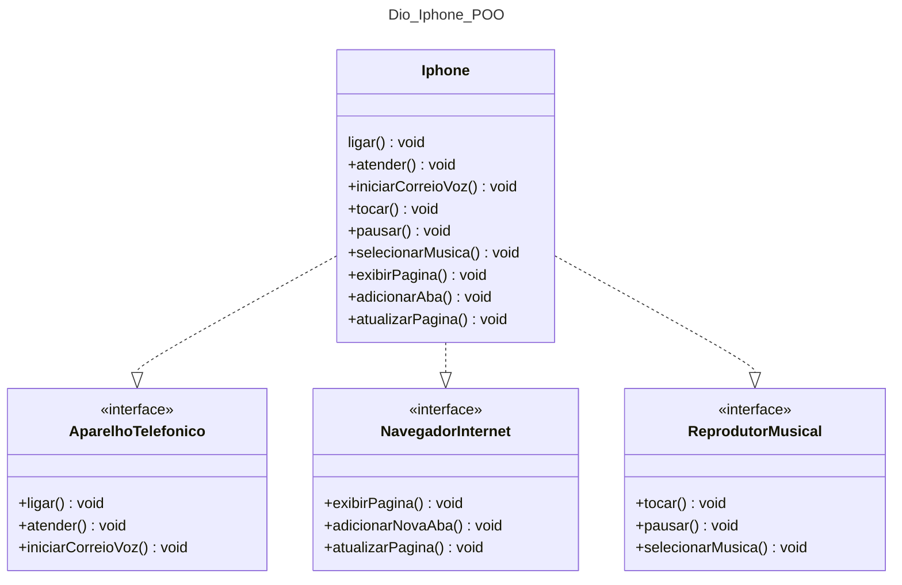

# Iphone-Dio
Exercício prático de POO usando o Iphone como exemplo. 

## Diagrama UML 

```mermaid
---
title: Dio_Iphone_POO
---
classDiagram
    
    class Iphone {
       ligar() void
       +atender() void
       +iniciarCorreioVoz() void
       +tocar() void
       +pausar() void
       +selecionarMusica() void
       +exibirPagina() void
       +adicionarAba() void
       +atualizarPagina() void
    }

    class AparelhoTelefonico {
        <<interface>>
        +ligar() void
        +atender() void
        +iniciarCorreioVoz() void
    }

    class NavegadorInternet {
        <<interface>>
       +exibirPagina() void
       +adicionarNovaAba() void
       +atualizarPagina() void

    }

   class ReprodutorMusical {
        <<interface>>
        +tocar() void
        +pausar() void
        +selecionarMusica() void 
    }

    Iphone ..|> AparelhoTelefonico 
    Iphone ..|> NavegadorInternet 
    Iphone ..|> ReprodutorMusical 
```
